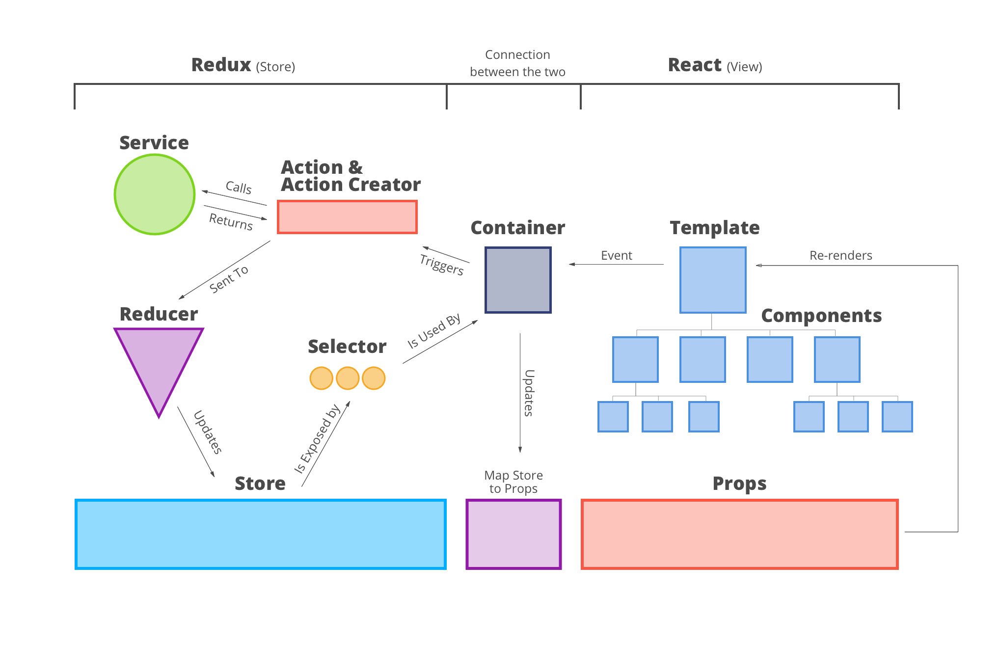
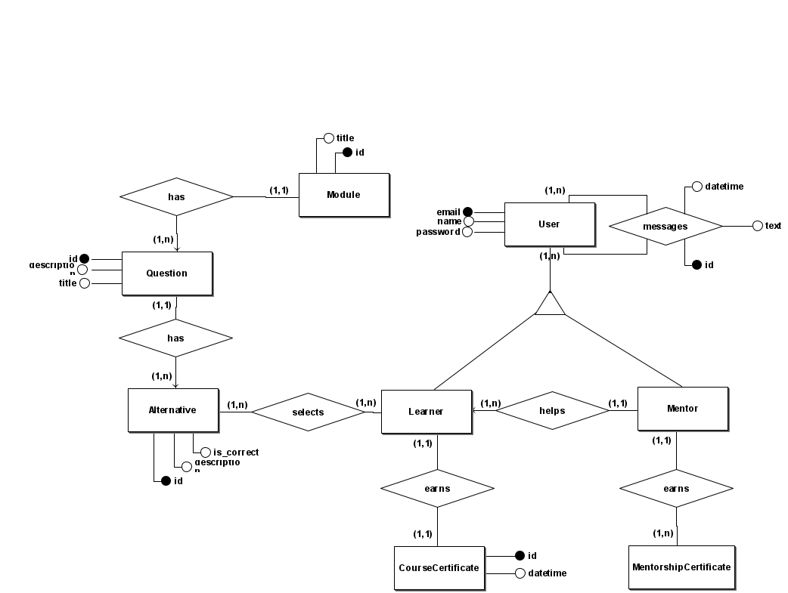
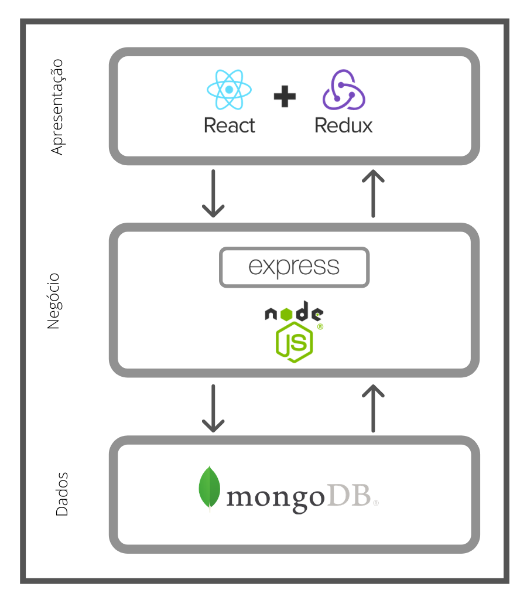

# Documento de Arquitetura

|Data|Versão|Descrição|Autor|
|----|------|---------|-----|
|03/09/2020| 0.1.0| Inserção dos tópicos de "Introdução" e "Representação da Arquitetura" | Estevão |
|03/09/2020| 0.2.0| Inserção do tópico "Tamanho e Desempenho" | Eduardo |
|03/09/2020| 0.3.0| Inserção do tópico "Metas e Restrições da Arquitetura" | Eduardo |
|04/09/2020| 0.3.1| Correções de formatação de Referência e Inserção de imagens nos tópicos "2.1.3 Representação arquitetural da camada de apresentação" e "2.4.Diagrama de Relações" | Estevão|
|11/09/2020| 0.4.0| Inserção do tópico Diagrama da Modelagem do Banco de Dados | Rodrigo e Estevão
|02/10/2020| 1.0.0| Atualizando DER | Geovana
|02/12/2020|1.0.1| Correção de erros ortográficos|Estevão Reis|
|05/12/2020| 1.1.0| Inserção dos tópicos "2.1.3 Reselect", "2.2.3 Socket.IO" e descrição do diagrama Redux-React | Eduardo |

## 1.Introdução

### 1.1.Finalidade

Este documento tem como finalidade apresentar a arquitetura do projeto Minacademy,oferecendo uma visão geral arquitetural do sistema que será implementado, possibilitando assim que os envolvidos no projeto tenham conhecimento de como a aplicação será subdivida e quais serão as funções de cada componente.

### 1.2.Escopo

Este documento apresenta as características arquiteturais do projeto Minacademy, expondo detalhadamente as soluções arquiteturais idealizadas e estabelecidas para o projeto, de modo a ser utilizado como base para a edificação do projeto pelos desenvolvedores designados para o projeto.

### 1.3.Definições, acrônimos, abreviações

|Definições/Acrônimos/Abreviações| Significado|
|--------------------------------|------------|
|MERN|MongoDB, Express, React, Node|
|MC| Model Controller|
|UI|User Interface (Interface do Usuário)|
|GUI|Graphical User Interface|
|MVC| Model View Controller|

### 1.4.Referências Bibliográficas

[1]_Modelo em três camadas_. Disponível em <https://pt.wikipedia.org/wiki/Modelo_em_tr%C3%AAs_camadas>.Acesso em 03 de Setembro de 2020.

[2]_MERN Stack_. Disponível em <https://www.mongodb.com/mern-stack>. Acesso em 02 de Setembro de 2020

[3]_Tutorial: Introdução ao React_. Disponível em <https://pt-br.reactjs.org/tutorial/tutorial.html>. Acesso em 03 de Setembro de 2020

[4]_Redux Essentials, Part 1: Redux Overview and Concepts_. Disponível em <https://redux.js.org/tutorials/essentials/part-1-overview-concepts>. Acesso em 03 de Setembro de 2020.

[5]_Node.js – O que é, como funciona e quais as vantagens_. Disponível em <https://www.opus-software.com.br/node-js/>. Acesso em 04 de Setembro de 2020.

[6]_Express Framework web rápido, flexível e minimalista para Node.js_. Disponível em <https://expressjs.com/pt-br/>. Acesso em 03 de Setembro de 2020.

[7]_MongoDB_. Disponível em <https://pt.wikipedia.org/wiki/MongoDB>. Acesso em 03 de Setembro de 2020.

[8]_Elm architecture with React + Redux + Redux-loop_. Disponível em <https://smallbusinessforum.co/elm-architecture-with-react-redux-redux-loop-645a67070b1a>. Acesso em 03 de Setembro de 2020.

[9]_MVC_. Disponível em <https://pt.wikipedia.org/wiki/MVC#:~:text=MVC%20%C3%A9%20o%20acr%C3%B4nimo%20de,a%20apresenta%C3%A7%C3%A3o%20dos%20dados%20e>. Acesso em 04 de Setembro de 2020.

[10]_diag-bd_. Disponível na pasta do projeto em <https://github.com/fga-eps-mds/2020.1-Grupo4/blob/master/docs/documentos/imagens/diag-bd.png> Acesso em 11 de Setembro de 2020.

[11]_diag-arqui_. Disponível na pasta do projeto em <https://github.com/fga-eps-mds/2020.1-Grupo4/blob/master/docs/documentos/imagens/diag-arqui.png> Acesso em 11 de Setembro de 2020

[12]_diag-redux_. Disponível na pasta do projeto em <https://github.com/fga-eps-mds/2020.1-Grupo4/blob/master/docs/documentos/imagens/diag-redux.png> Acesso em 04 de Dezembro de 2020

[13]_diag-pack_. Disponível na pasta do projeto em <https://github.com/fga-eps-mds/2020.1-Grupo4/blob/master/docs/documentos/imagens/diag-pack.png> Acesso em 04 de Dezembro de 2020

### 1.5.Visão Geral

|Tópico| Descrição|
|------|----------|
|Introdução| Fornece uma visão geral do documento inteiro, descrevendo informações sobre a sua finalidade|
|Representação Arquitetural| Traz o detalhamento da arquitetura de software do sistema para melhor entendimento de sua estrutura e funcionamento. Além de apresentar o modo como ela está sendo representada.|
|Metas e Restrições| Detalha os requisitos e objetivos do software que têm algum impacto sobre a arquitetura. Ela também captura as restrições especiais que podem ser aplicáveis.|
|Visão lógica| Retrata as partes relevantes concernente à arquitetura do modelo de design. |
|Visão de implementação| Descreve a estrutura geral do modelo de implementação, a divisão do software em camadas e os subsistemas no modelo de implementação e todos os componentes significativos do ponto de vista da arquitetura.|

## 2.Representação da Arquitetura

A arquitetura do projeto **minacademy** é composta por frontend e backend desacoplados, cada um possuindo seu próprio repositório. Por consequência desse desacoplamento, o risco de uma mudança em um dos dois não causará efeitos colaterais na implementação do outro. O modelo de arquitetura que será utilizada é Modelo em 3 Camadas(3-Tier), expecificamente o modelo MERN Stack.

O modelo 3-Tier, derivado do modelo 'n' camadas, organizando a aplicação nas camadas de apresentação, de negócio e de dados. A separação em camadas lógicas torna os sistemas mais flexíveis, permitindo que as partes possam ser alteradas de forma independente. As funcionalidades da camada de negócio podem ser divididas em classes e essas classes podem ser agrupadas em pacotes ou componentes, reduzindo as dependências entre as classes e pacotes; podem ser reutilizadas por diferentes partes do aplicativo e até por aplicativos diferentes. O modelo de 3 camadas tornou-se a arquitetura padrão para sistemas corporativos com base na Web.[1]

MERN é o acrônimo para MongoDB, Express, React, Node, nome das quatro tecnologias principais que compõem a stack. A arquitetura MERN permite que você construa facilmente uma arquitetura de 3 camadas (front-end, back-end, banco de dados) inteiramente usando JavaScript e JSON[2].

### 2.1.Camada de apresentação (Front-end)

É a chamada GUI, ou simplesmente interface. Esta camada interage diretamente com o usuário, é através dela que são feitas as requisições como consultas, por exemplo. Nessa camada são utilizadas as tecnologias React em conjunto com a Redux.[1]

#### 2.1.1 React

O React é uma biblioteca JavaScript declarativa, eficiente e flexível para criar interfaces com o usuário. Ele permite compor UIs complexas a partir de pequenos e isolados códigos chamados “componentes”[3].

#### 2.1.2 Redux

Redux é um padrão e biblioteca para gerenciar e atualizar o estado do aplicativo, usando eventos chamados "ações". Ele serve como um armazenamento centralizado para o estado que precisa ser usado em todo o seu aplicativo, com regras que garantem que o estado só possa ser atualizado de maneira previsível.[4]

#### 2.1.3 Reselect

Reselect é um biblioteca para construir *memoized* *selectors*, funções que recuperam trechos do estado do Redux para os componentes React. Usando o processo de *memoization*, é possível previnir rerenders desnecessarios e recalculações de dados derivados do Redux, o que irá melhorar a performance da aplicação.
#### 2.1.4 Representação arquitetural da camada de apresentação

[8]

#### 2.1.5 Diagrama Redux-React
[12]

**Store**: A *Store* carrega toda a árvore de estados da aplicação. O único modo de alterar o estado é dispachando *Actions*.

**Action**: São *payloads* de informação que enviam dados da aplicação para a *Store*. Elas são a única fonte de informação para a *Store*.

**Reducer**: Cria um bloco independente de estado e especifica como esse estado deve ser alterado em resposta a uma *Action*.

**Container**: Faz a conexão entre a aplicação e a *Store* do Redux, gerencia eventos e fornece o estado.

**Selector**:  Uma função que recebe estado como argumento e retorna dados derivados do mesmo. *Selectors* criados usando a biblioteca Reselect podem ser usados para computar dados derivados de maneira mais eficiente.

**Template**: É o conjunto das partes menores da aplicação, os componentes têm somente uma responsabilidade e não possuem estado.

### 2.2.Camada de negócio (Back-end)

Também chamada de lógica empresarial, regras de negócio ou funcionalidade. É nela que ficam as funções e regras de todo o negócio. Não existe uma interface para o usuário e seus dados são voláteis[1]. Nessa camada são utilizadas as tecnologias Node em conjunto com Express

#### 2.2.1 Node

O Node.js pode ser definido como um ambiente de execução Javascript server-side.Isso significa que com o Node.js é possível criar aplicações Javascript para rodar como uma aplicação standalone em uma máquina, não dependendo de um browser para a execução[5]. Na aplicação o node fará uso da arquitetura MC, proveniente da arquitetura MVC, excluindo a parte V que lida com a interface do usuário, a tecnologia React será responsável por essa parte.

MVC é o acrônimo de Model-View-Controller (em português: Arquitetura Modelo-Visão-Controle - MVC) é um padrão de projeto de software,ou padrão de arquitetura de software, focado no reuso de código e a separação de conceitos em três camadas interconectadas, onde a apresentação dos dados e interação dos usuários (front-end) são separados dos métodos que interagem com o banco de dados (back-end).[9]

#### 2.2.2 Express

O Express é um framework para aplicativo da web do Node.js mínimo e flexível que fornece um conjunto robusto de recursos para aplicativos web e móvel[6].

#### 2.2.3 Socket.IO

SocketIO é uma biblioteca JavaScript para aplicativos da web em tempo real. Permite comunicação bidirecional em tempo real entre clientes e servidores da Web. Ele tem duas partes: uma biblioteca do lado do cliente que é executada no navegador e uma biblioteca do lado do servidor para o Node.js.

### 2.3.Camada de Dados

É composta pelo repositório das informações e as classes que as manipulam. Esta camada recebe as requisições da camada de negócios e seus métodos executam essas requisições em um banco de dados[1]. Nessa câmara é utilizada a tecnologia MongoDB.

#### 2.3.1 MongoDB

MongoDB é um software de banco de dados orientado a documentos livre, de código aberto e multiplataforma, escrito na linguagem C++. Classificado como um programa de banco de dados NoSQL, o MongoDB armazena dados em documentos do tipo JSON. Suas características permitem com que as aplicações modelem informações de modo muito mais natural, pois os dados podem ser aninhados em hierarquias complexas e continuar a ser indexáveis e fáceis de buscar[7].

#### 2.3.2 Modelagem do Banco de Dados

[10]

### 2.4 Diagrama de Relações

[11]

### 2.5 Diagrama de Pacotes

- Back-End

[13]

- Front-End
## 3. Metas e Restrições da Arquitetura

### 3.1 Usabilidade

A aplicação contará com design responsivo, tendo um bom ajuste e posicionamento dos elementos em tela, com uma interface clara e intuitiva.

### 3.2 Portabilidade

A aplicação poderá ser acessada através de um navegador como, por exemplo,  Mozilla Firefox ou Google Chrome.

### 3.3 Restrições de Design

A aplicação ser desenvolvida em JavaScript, HTML e CSS, utilizando os frameworks NodeJS e ReactJS, e deve ser modelada para o banco MongoDB.

O projeto deve ser estruturado nos padrões da arquitetura em 3 camadas(3-Tier), mais especificamente a arquitetura MERN, com as camadas de “Apresentação”, “Negócio” e “Dados”.

Capaz de sofrer alterações e implementações tanto no Back-End quanto o Front-End.

## 4. Tamanho e Desempenho

A arquitetura foi planejada para que a aplicação atenda de forma satisfatória os requisitos do produto e permita uma fácil implementação e expansão de funcionalidades, sem a necessidade de dimensionar todo o sistema.

Na aplicação será abordado o conceito de SPA(Single-Page-Application), que possibilita a renderização dinâmica de conteúdo ao contrário de um carregamento completo da página, reduzindo o tempo de espera e proporcionando uma melhor e mais fluida experiência para o usuário.

O tempo de resposta da aplicação web irá depender da velocidade de conexão com a internet do usuário e da a conexão com o banco de dados, assim como a disponibilidade do servidor.
