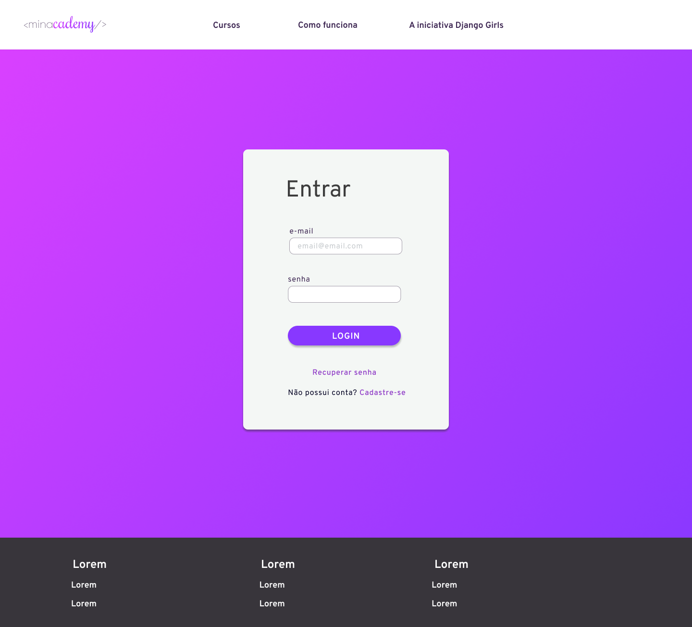

# Protótipo de Alta Fidelidade

## Tela Inicial

### A página que o usuário terá o primeiro contato

- Mostrará um pouco do que é a iniciativa Minacademy
- Mostrará o básico do funcionamento da plataforma

## Login

 Para ter acesso ao curso é requisitado o login e senha.

## Registro

### O usuário faz registro na plataforma, escolhendo entre duas formas de cadastro:

- **Aprendiz:** É necessário que concorde que se identifica com gênero feminino, para poder acessar o tutorial
- **Mentor não validado:** O usuário terá acesso somente ao tutorial, e não poderá ter aprendizes, a menos que responda corretamente 70% do exame, dessa forma passará a poder exercer a função de mentor.

## Dashboard

### O usuário tem acesso ao progresso no curso;

- Terá um link para visualizar os certificados.

## Chat

Será possível visualizar o chat em qualquer uma das telas quando o usuário estiver logado.

## Perfil do Usuário

Na página de configurações de usuário, abrirá uma caixa com as informações do usuário, que poderão ser atualizadas, caso queira.

## Tutorial

### O usuário tem acesso ao Tutorial Interativo do disponibilizado pelo site da "Django Girls", contando com os seguintes recursos:

- **Lista de Atividades:** O usuário poderá ver quais atividades foram feitas, quais estão habilitadas para fazer e navegar por todas elas.
- **Lista de Módulos do Tutorial:** O usuário poderá ver quais partes do tutorial está habilitada, e navegar pelo mesmo.
- **Progresso e atividades concluídas:** O usuário poderá ver seu progresso no tutorial e as atividades já concluídas.
- **Tutorial Interativo:** O tutorial e atividades serão consumidos pelo usuário.

A mesma interface com a lista de módulos:

## Certificado

Certificados que o usuário possui, o mesmo poderá validar, compartilhar e salvar no dispositivos os certificados.

