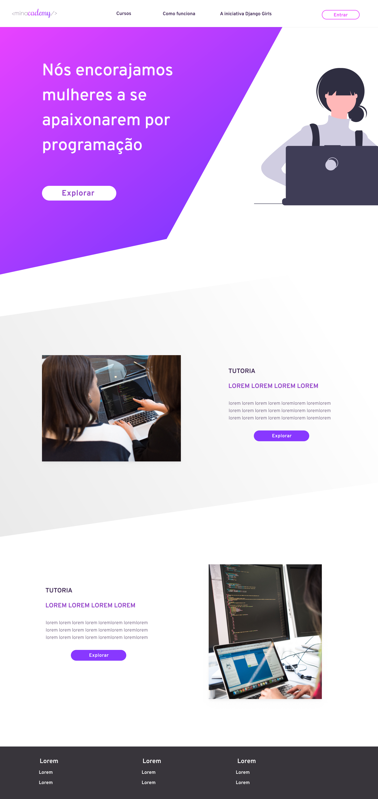
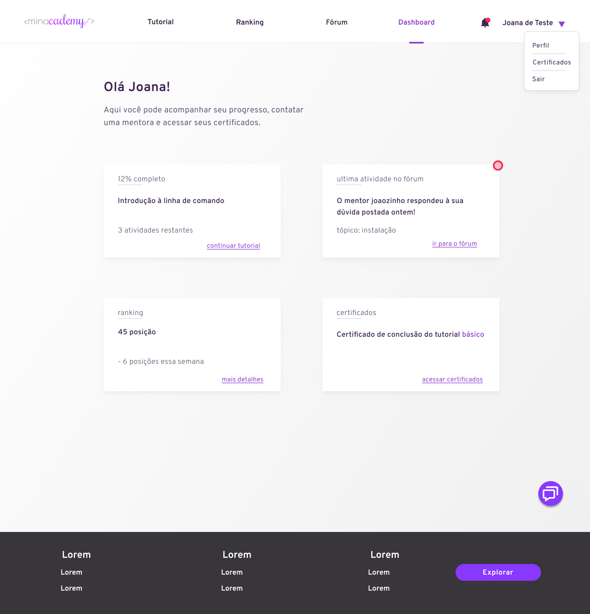
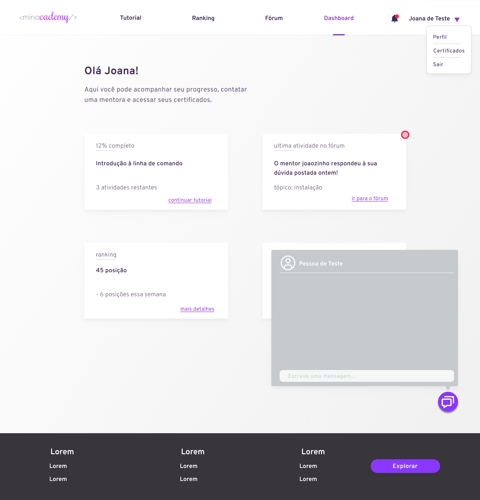
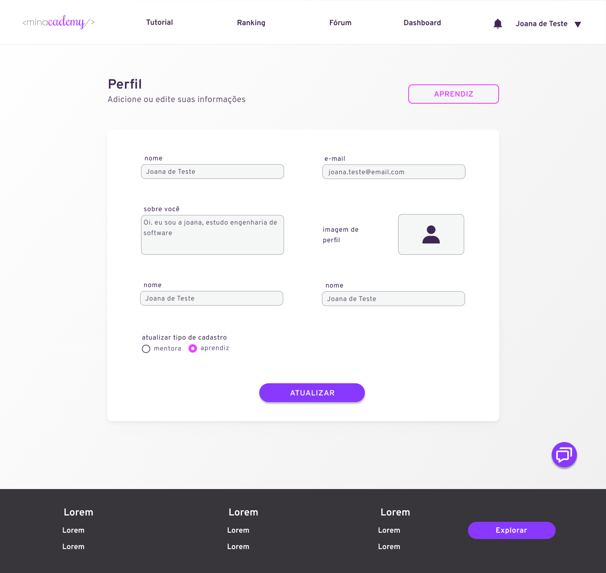
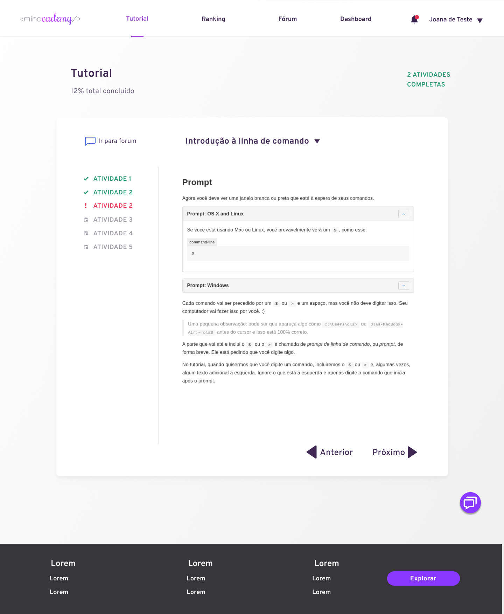
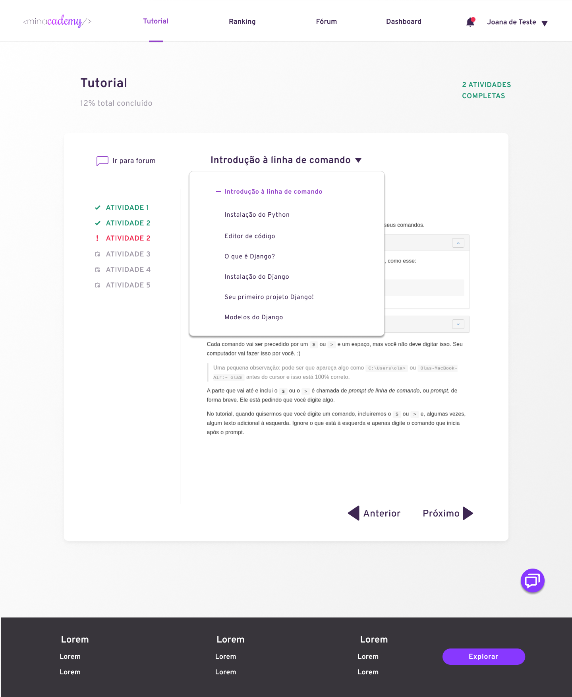
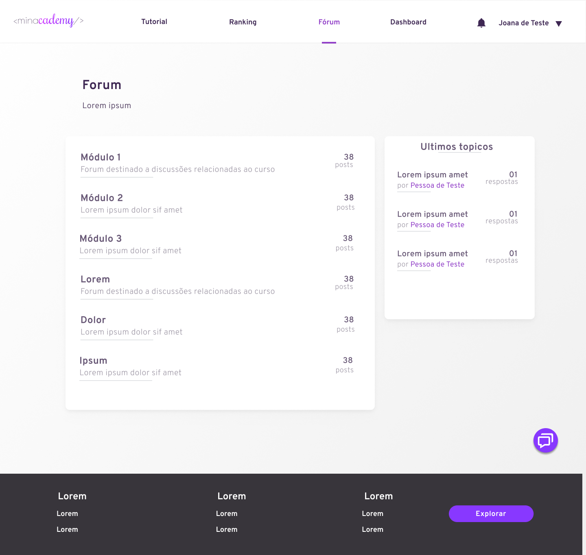
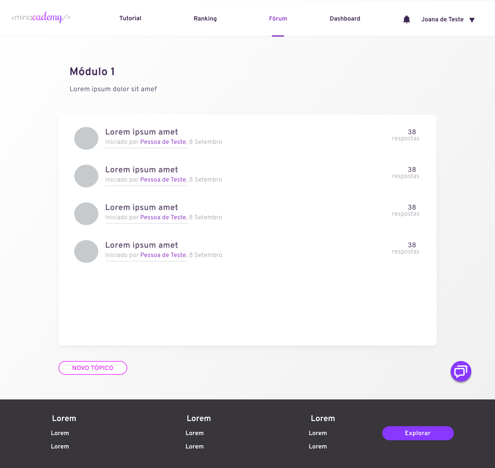
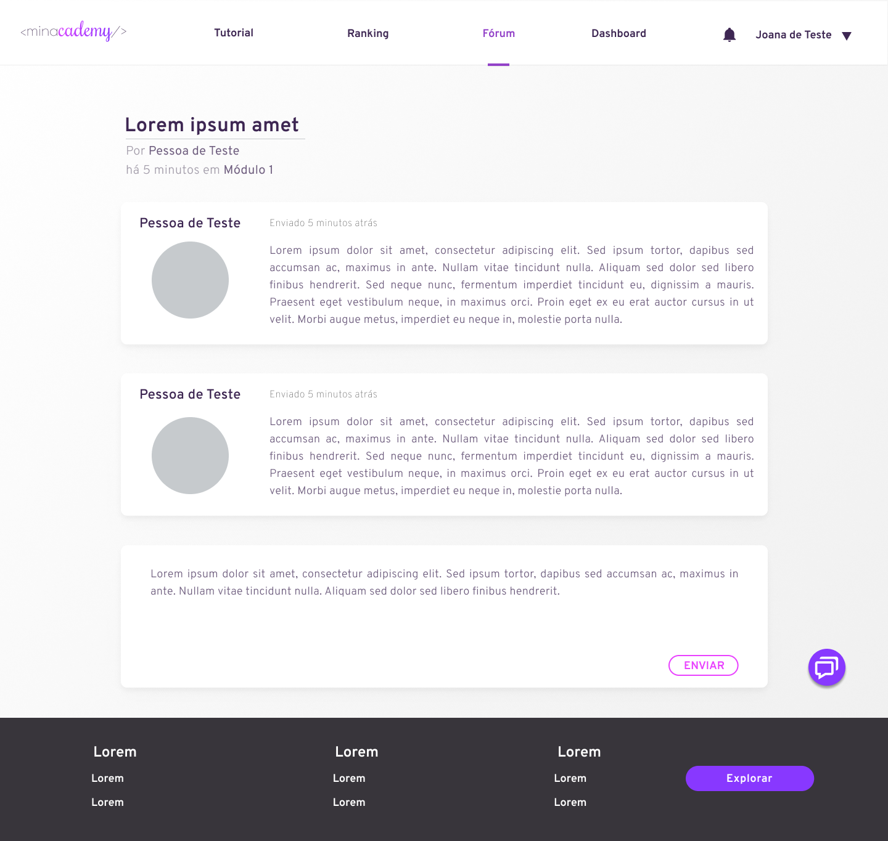
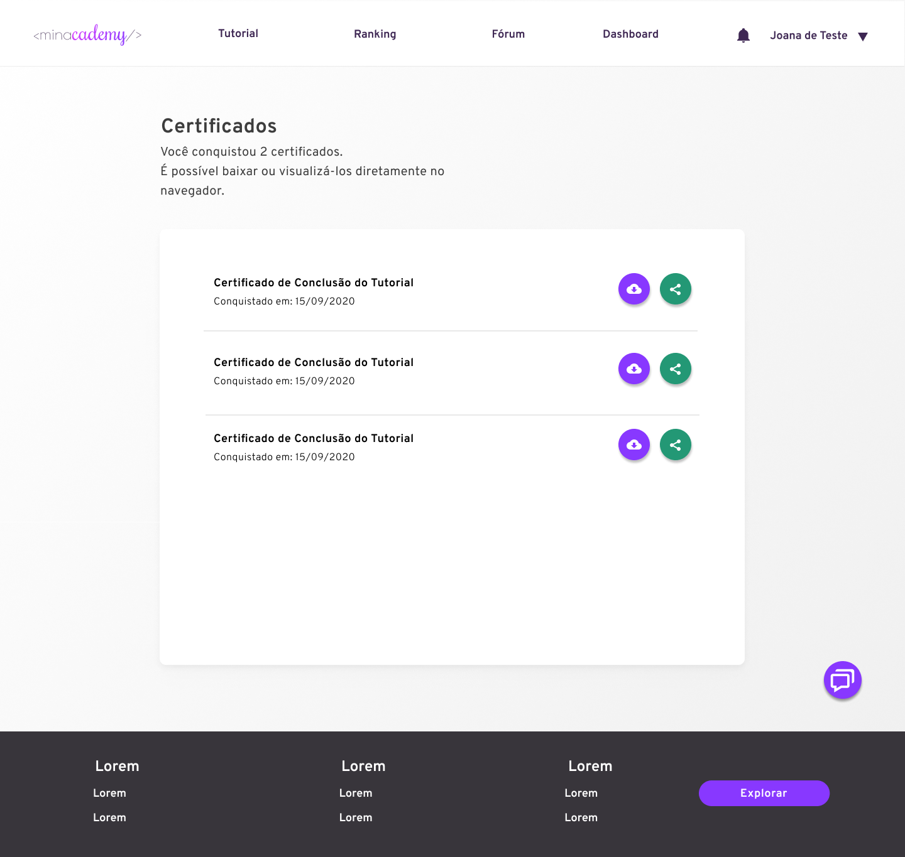

# Protótipo de Alta Fidelidade

## Tela Inicial

### A página que o usuário terá o primeiro contato

- Mostrará um pouco do que é a iniciativa Minacademy
- Mostrará o básico do funcionamento da plataforma

## Login

### Para ter acesso ao curso é requisitado o login e senha.

## Registro

### O usuário faz registro na plataforma, escolhendo entre duas formas de cadastro:

- **Aprendiz:** É necessário que concorde que se identifica com gênero feminino, para poder acessar o tutorial
- **Mentor com Restrição ao Fórum:** O usuário terá acesso somente ao fórum, e não poderá ter aprendizes, a menos que responda três questões do fórum, marcadas como solução, dessa forma passará a poder exercer a função de mentor.

## Dashboard

### O usuário tem acesso ao progresso no curso;

- Terá um link para visualizar os certificados.
- Mostrará notificações, como um aviso de alguma interação no fórum.
- Haverá um link para visualizar o rank e a posição do usuário no mesmo .

## Chat
Será possível visualizar o chat em qualquer uma das telas quando o usuário estiver logado.

## Perfíl do Usuário

Na pagína de configurações de usuário, abrirá uma caixa com as informações do usuário, que poderão ser atualizadas, caso queira.

## Tutorial

### O usuário tem acesso ao Tutorial Interativo do disponibilizado pelo site da "Django Girls", contando com os seguintes recursos:

- **Lista de Atividades:** O usuário poderá ver quais atividades foram feitas, quais estão habilitadas para fazer e navegar por todas elas.
- **Lista de Módulos do Tutorial:** O usuário poderá ver quais partes do tutorial está habilitada, e navegar pelo mesmo.
- **Progresso e atividades concluídas:** O usuário poderá ver seu progresso no tutorial e as atividades já concluídas.
- **Tutorial Interativo:** O tutorial e atividades serão consumidos pelo usuário.
- **Fórum:** Haverá um link para ter acesso ao fórum referente àquela atividade.

A mesma interface com a lista de módulos:

## Ranking

Nesta página o usuário poderá verificar sua pontuação, assim como visualizar o ranking global

## Fórum

### O fórum é o local onde haverá feedbacks, dúvidas e soluções da comunidade, o usuário poderá selecionar o módulo a qual ele se refere para redirecioná-lo para um "subfórum" referente ao módulo, lá será possível criar e responder tópicos.

Listagem de tópicos

Pagina do tópico

## Certificado

Certificados que o usuário possui, o mesmo poderá validar, compartilhar e salvar no dispositivos os certificados.

