# Protótipo de Baixa Fidelidade

## Login

O usuário é requisitado o login e senha para acessar a plataforma, ou para que faça cadastro na mesma

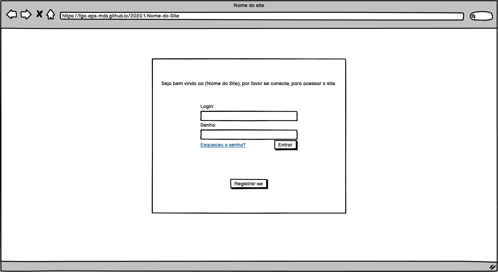

## Registro

O usuário faz registro na plataforma, escolhendo entre duas formas de cadastro:

- **Aprendiz:** É necessário que concorde que se identifica com gênero femenino, para poder acessar o tutorial
- **Mentor com Restrição ao Fórum:** O usuário terá acesso somente ao fórum, e não poderá ter aprendizes, a menos que responda três questões do fórum, marcadas como solução.

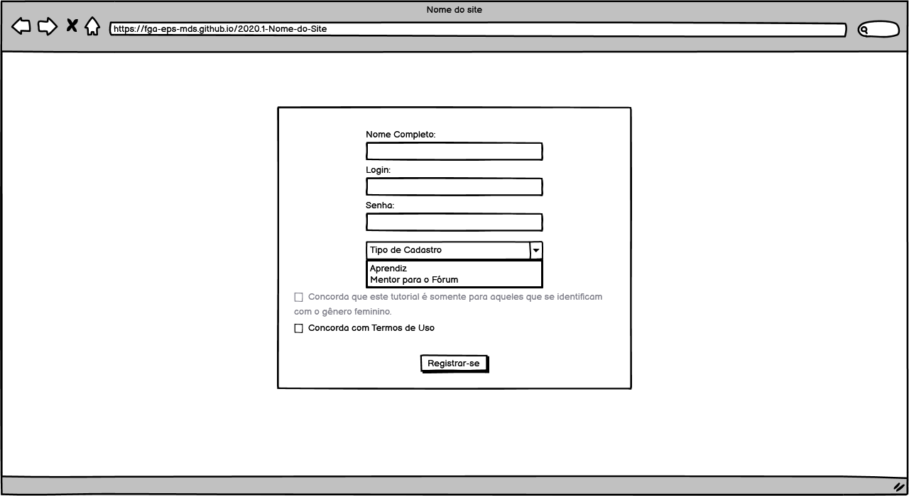

## Tutorial

O usuário tem acesso ao Tutorial Interativo do Django Girls, contando com os seguintes recursos:

- **Barra de Conteúdo do Tutorial:** O usuário poderá ver quais partes do tutorial está habilitada, e navegar pelo mesmo.
- **Lista de Atividades:** O usuário poderá ver quais atividades foram feitas, quais estão habilitadas para fazer e navegar por todas elas
- **Ferramentas do Usuário:** O usuário poderá ver informações rápidas, como nome, pontos e barra de progressão do tutorial.Também tem acesso a ícones que redirecionam para respectivamente: Certificados, Fórum, Notificações, Opções de Mentoria e Configurações do Usuário
- **Tutorial Interativa:** Onde o tutorial e atividades serão consumidos pelo usuário
- **Chat com Mentor:** Caso o usuário escolha por ter um Mentor, haverá uma caixa de mensagens rápidas, para tirar dúvidas.

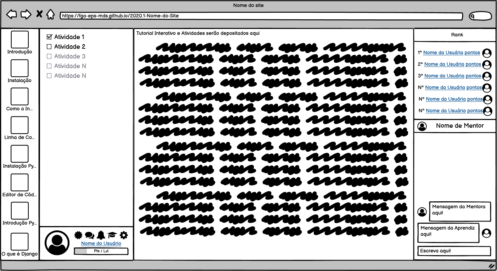

A mesma interface sem o chat com mentor

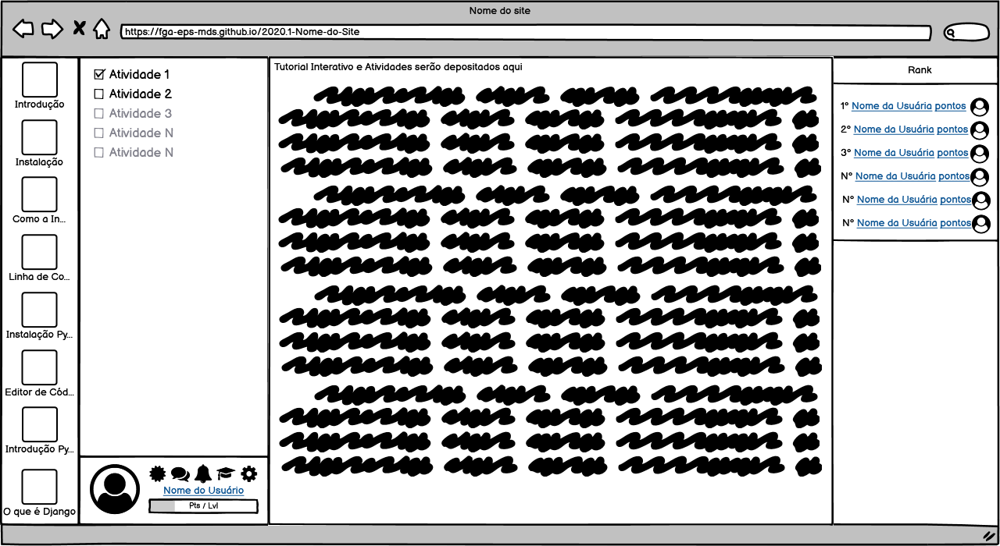

## Configurações do Usuário

No ícone de configurações de usuário, abrirá uma caixa com as informações do usuário, que poderão ser atualizadas, caso queira.

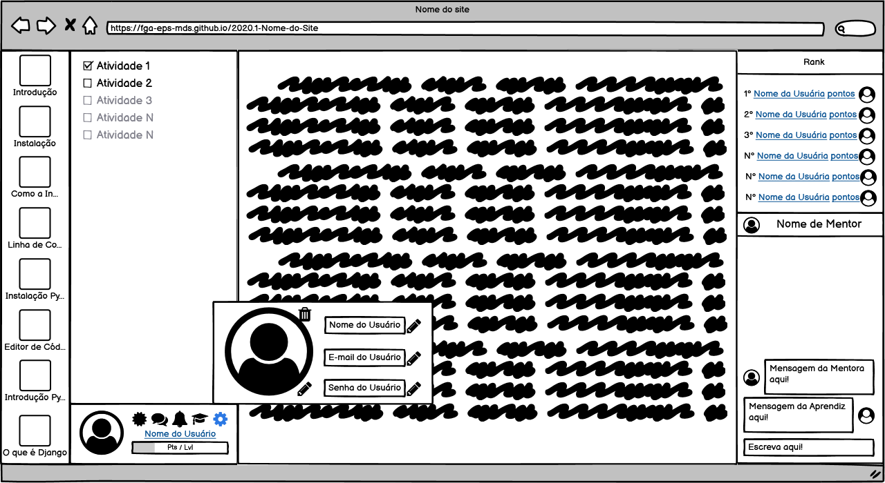

A mesma interface sem o chat com mentor

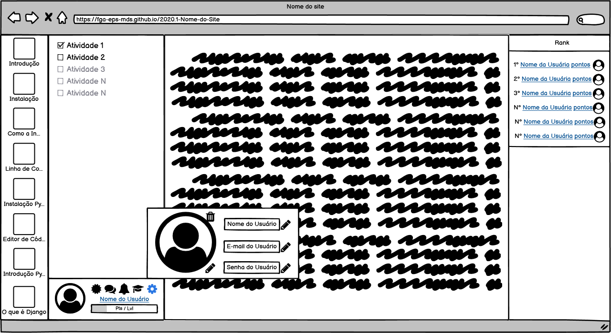

## Opções de Mentoria ou Chat do Mentor

Caso o usuário seja um aprendiz sem um mentor, ao clicar no ícone de opções de Mentoria, irá aparecer uma lista de mentores, o qual o usuário pode requisitar mentoria, clicando no ícone.

Caso o usuário seja um aprendiz com mentor, ao clicar no ícone de opções de Mentoria, irá aparecer as informações do tutor, e dois ícones, reclamação e desvincular-se ao mentor.

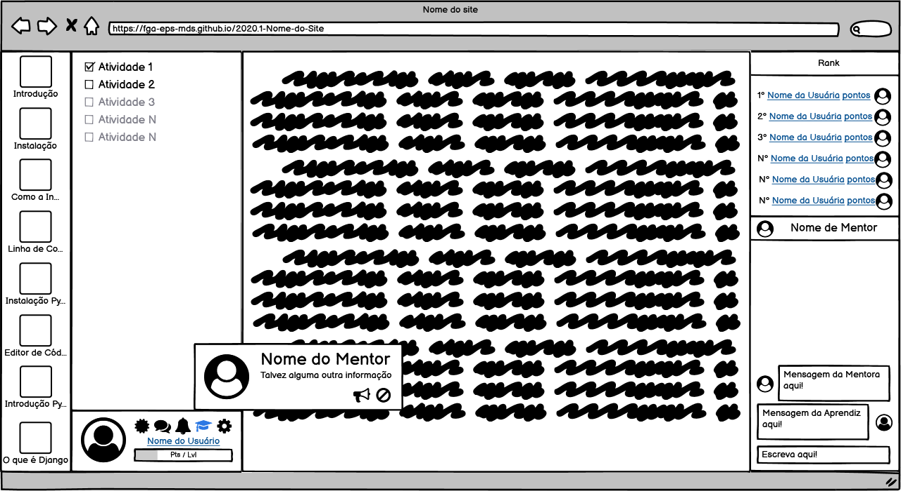

Caso o usuário seja um mentor, ao clicar no ícone de opções de Mentoria, ele será redirecionado para uma outra interface, o chat do mentor, a qual ele tem a lista de suas aprendizes, as quais pode selecionar, com qual chat irá interagir, as mesmas também apresentam os ícones de reclamação e de desvincular-se. Acima da lista de aprendizes, há um ícone que quando habilitado, significa que o mentor está recebendo novos aprendizes.

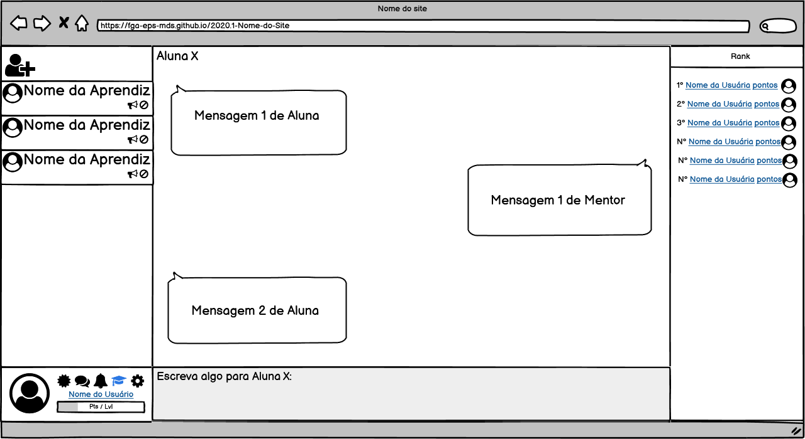

## Notificação

O ícone de notificação apresentará um contador de atualização, ao clicar no ícone, ele apresentará uma caixa com mensagens de notificações

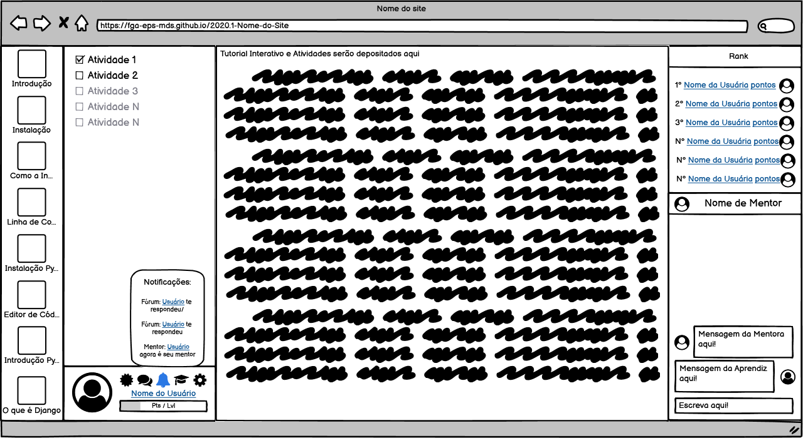

A mesma interface sem o chat com mentor

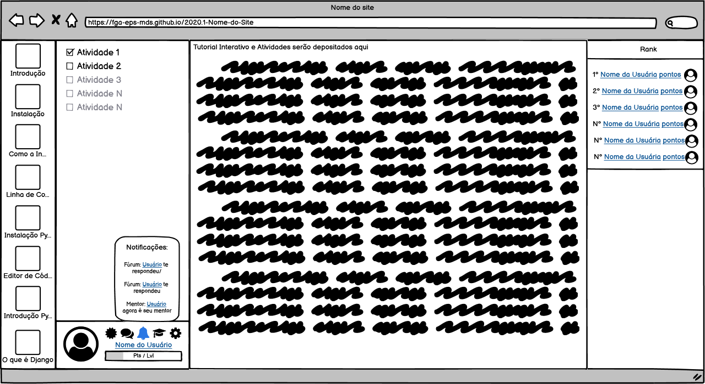

## Certificado

Será substituído o local do tutorial interativo, pela lista dos certificados que o usuário possui, o mesmo poderá validar, compartilhar e salvar no dispositivos os certificados.

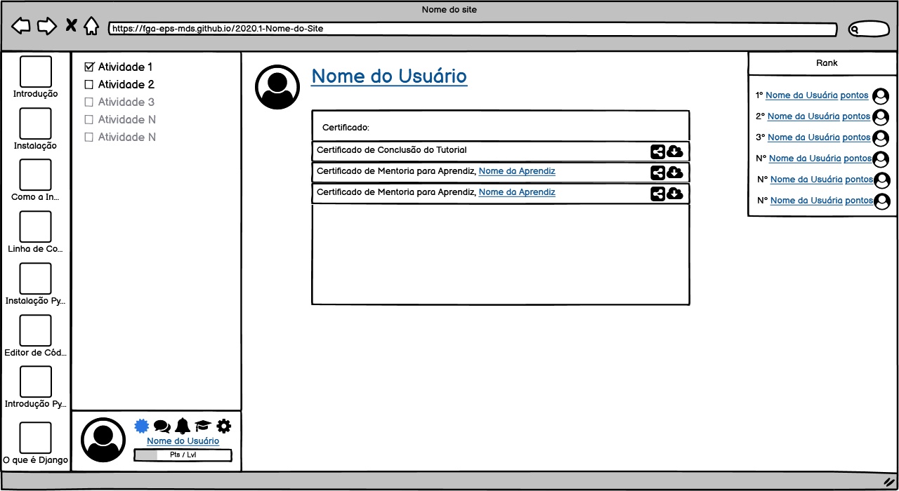